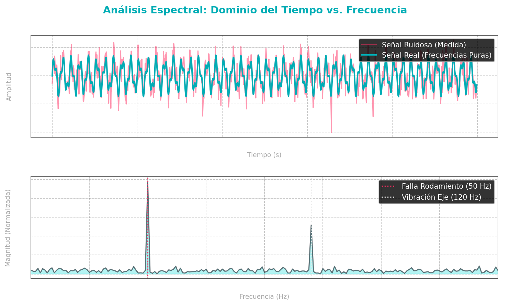
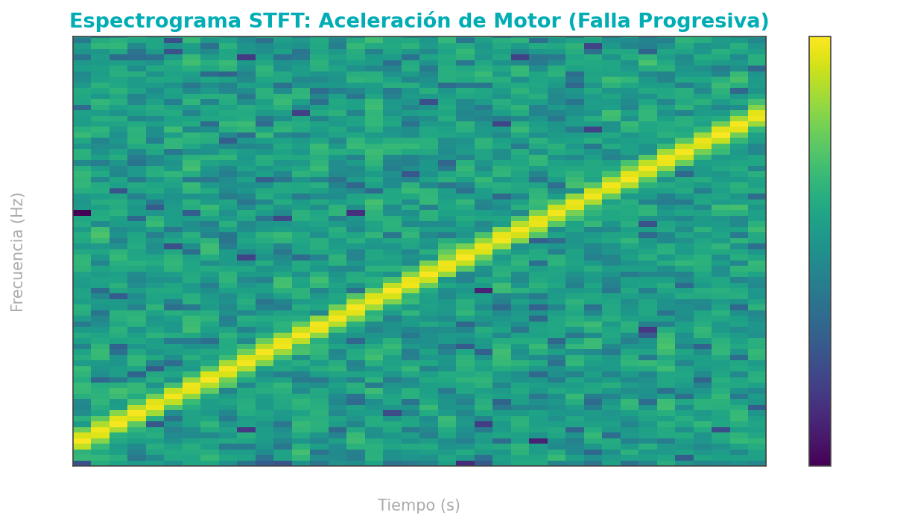

# 🚀 Fast Fourier Transform (FFT) & Discrete Fourier Transform (DFT) for Predictive Maintenance

A mathematically rigorous and visual guide to signal processing, time-frequency transformations, and their application in **Industry 4.0** and **Deep Learning-driven Fault Diagnosis**.

---

## 📖 Introduction to Fourier Analysis

In physical industrial systems, sensors (accelerometers, acoustic emission microphones, current sensors) capture data in the **Time Domain**. However, complex machinery contains multiple components rotating at different speeds. The raw vibration signal is a mixture of all these sources, often heavily corrupted by environmental noise.

The **Fourier Transform** acts as a mathematical prism. Just as a glass prism decomposes white light into its constituent wavelengths (colors), the Fourier Transform decomposes a complex time-series signal into its constituent sinusoidal waves of different frequencies.

```text
Time-Domain Waveform (Vibration) ──▶ [ Fourier Transform ] ──▶ Frequency Spectrum (Component Speeds)
```

---

## 🧮 1. The Discrete Fourier Transform (DFT)

To analyze digital signals sampled at discrete intervals, we use the **Discrete Fourier Transform (DFT)**.

### Mathematical Formulation
Given a sequence of $N$ complex numbers $x_n$ representing the signal sampled at time steps $n = 0, \dots, N-1$, the DFT converts them into a sequence of $N$ frequency components $X_k$:

$$X_k = \sum_{n=0}^{N-1} x_n \cdot e^{-i 2\pi \frac{k}{N} n}, \quad k = 0, \dots, N-1$$

Where:
*   $x_n$: The digital input signal amplitude at index $n$.
*   $X_k$: The complex coefficient representing amplitude and phase at frequency index $k$.
*   $e^{-i 2\pi \frac{k}{N} n}$: The complex exponential basis function.

### Euler's Relation & Complex Correlation
To understand how the DFT extracts frequencies, we expand the complex exponential using **Euler's Formula**:

$$e^{-i\theta} = \cos(\theta) - i\sin(\theta)$$

Substituting this back into the DFT equation:

$$X_k = \sum_{n=0}^{N-1} x_n \left[ \cos\left(2\pi \frac{k}{N} n\right) - i\sin\left(2\pi \frac{k}{N} n\right) \right]$$

Thus, each frequency coefficient $X_k$ consists of:
*   **Real Part ($\text{Re}\{X_k\}$):** The correlation of the signal with a cosine wave at frequency index $k$ (capturing even symmetries).
*   **Imaginary Part ($\text{Im}\{X_k\}$):** The correlation of the signal with a sine wave at frequency index $k$ (capturing odd symmetries).

---

## ⚡ 2. The Fast Fourier Transform (FFT)

Calculating the DFT directly requires $N$ multiplications for each of the $N$ outputs, leading to a computational complexity of **$\mathcal{O}(N^2)$**. For large datasets (e.g., $10^6$ vibration points), this is too slow for real-time monitoring.

The **Fast Fourier Transform (FFT)** is an optimized algorithm (originally developed by Cooley and Tukey in 1965) that computes the exact same DFT in **$\mathcal{O}(N \log_2 N)$** operations.

### Cooley-Tukey Radix-2 Derivation
The algorithm uses a divide-and-conquer strategy, splitting a DFT of size $N$ (where $N$ is a power of 2) into two smaller DFTs of size $N/2$: one for even-indexed points and one for odd-indexed points.

Using the **Twiddle Factor** notation $W_N = e^{-i \frac{2\pi}{N}}$, the DFT is:

$$X_k = \sum_{n=0}^{N-1} x_n W_N^{nk}$$

Splitting the summation into even indices ($n = 2r$) and odd indices ($n = 2r+1$):

$$X_k = \sum_{r=0}^{N/2-1} x_{2r} W_N^{2rk} + \sum_{r=0}^{N/2-1} x_{2r+1} W_N^{(2r+1)k}$$

Since $W_N^{2rk} = e^{-i \frac{2\pi}{N} (2rk)} = e^{-i \frac{2\pi}{N/2} rk} = W_{N/2}^{rk}$, we can rewrite this as:

$$X_k = \sum_{r=0}^{N/2-1} x_{2r} W_{N/2}^{rk} + W_N^k \sum_{r=0}^{N/2-1} x_{2r+1} W_{N/2}^{rk}$$

$$X_k = E_k + W_N^k O_k$$

Where:
*   $E_k$: The DFT of the even-indexed terms of $x_n$.
*   $O_k$: The DFT of the odd-indexed terms of $x_n$.

### Symmetry and Periodicity (The Butterfly Operation)
Because $E_k$ and $O_k$ are periodic with period $N/2$, we only need to compute them for $k = 0, \dots, N/2 - 1$. For indices $k \ge N/2$:

$$X_{k + N/2} = E_k - W_N^k O_k$$

This mathematical symmetry forms the **Butterfly Diagram**, allowing us to compute both outputs simultaneously, bypassing redundant operations.

---

## 📊 3. Visual Analysis (Generated via Python)

Below are the actual spectral plots generated in Python showing how a signal is analyzed.

### A. Time Domain vs. Frequency Spectrum
The top plot shows a noisy vibration signal (mixed frequencies $+ \text{Gaussian noise}$). The bottom plot shows the computed FFT spectrum. The FFT clearly isolates the two hidden physical frequencies ($50\text{ Hz}$ and $120\text{ Hz}$), filtering out the noise.



### B. Short-Time Fourier Transform (STFT) Spectrogram
For non-stationary signals (where the machine's rotation speed changes over time, e.g., during start-up or deceleration), a standard FFT fails because it averages the frequencies over the whole duration.

We apply the **STFT**, dividing the signal into overlapping sliding windows and computing the FFT for each window. This generates a **Spectrogram** (Time vs. Frequency vs. Power/Decibels).



---

## ⚙️ 4. Application in Predictive Maintenance & Deep Learning

In mechanical systems, specific defects create periodic impacts that appear as prominent frequency peaks:

$$\text{BPFI} = \frac{N_{balls}}{2} f_r \left( 1 + \frac{d}{D} \cos\alpha \right)$$
$$\text{BPFO} = \frac{N_{balls}}{2} f_r \left( 1 - \frac{d}{D} \cos\alpha \right)$$

*   **BPFI/BPFO:** Ball Pass Frequency (Inner/Outer Race).
*   $f_r$: Shaft rotation frequency.
*   $d, D$: Ball and Pitch diameters.

### Signal-to-Image Transformation for CNNs
In modern AI-driven diagnostics:
1.  **Vibration Signals (1D)** are recorded by accelerometers.
2.  The signals are transformed into **2D Images** (such as STFT Spectrograms, **Gramian Angular Fields (GAF)**, or Markov Transition Fields).
3.  A **2D Convolutional Neural Network (CNN)** (e.g., ResNet, MobileNet, or YOLO) is trained on these images to classify structural health in real time.

---

## 💻 Python Script: Plot Generation Code

This is the code used to generate the figures above using Python's `scipy` and `matplotlib` libraries:

```python
import os
import numpy as np
import scipy.fft
from scipy.signal import chirp
import matplotlib.pyplot as plt

# Setup styles for visual look
plt.style.use('dark_background')

# 1. Generate Composite Signal with Noise
fs = 1000  # Sampling frequency
t = np.linspace(0, 1, fs, endpoint=False)
clean_signal = np.sin(2 * np.pi * 50 * t) + 0.5 * np.sin(2 * np.pi * 120 * t)
noise = np.random.normal(0, 0.6, len(t))
noisy_signal = clean_signal + noise

# 2. FFT Computation
fft_vals = scipy.fft.fft(noisy_signal)
fft_freqs = scipy.fft.fftfreq(len(t), 1/fs)

# Positive frequencies only
pos_mask = fft_freqs >= 0
freqs_plot = fft_freqs[pos_mask]
amplitude_plot = (2.0/len(t)) * np.abs(fft_vals[pos_mask])

# Plotting Time vs Frequency
fig, (ax1, ax2) = plt.subplots(2, 1, figsize=(10, 6), dpi=150)
ax1.plot(t, noisy_signal, color='#ff2e63', alpha=0.5, label='Noisy Signal')
ax1.plot(t, clean_signal, color='#00adb5', linewidth=2, label='Clean Signal')
ax1.set_title("Vibration Signal in Time Domain")
ax1.set_xlabel("Time (s)")
ax1.set_ylabel("Amplitude")
ax1.grid(True, linestyle='--', alpha=0.3)
ax1.legend()

ax2.plot(freqs_plot, amplitude_plot, color='#08d9d6')
ax2.set_xlim(0, 200)
ax2.set_title("Frequency Spectrum (FFT)")
ax2.set_xlabel("Frequency (Hz)")
ax2.set_ylabel("Normalized Magnitude")
ax2.grid(True, linestyle='--', alpha=0.3)
plt.tight_layout()
plt.show()
```

---
*Developed as part of the Artificial Intelligence and Industrial IoT (IIoT) Portfolio.*
