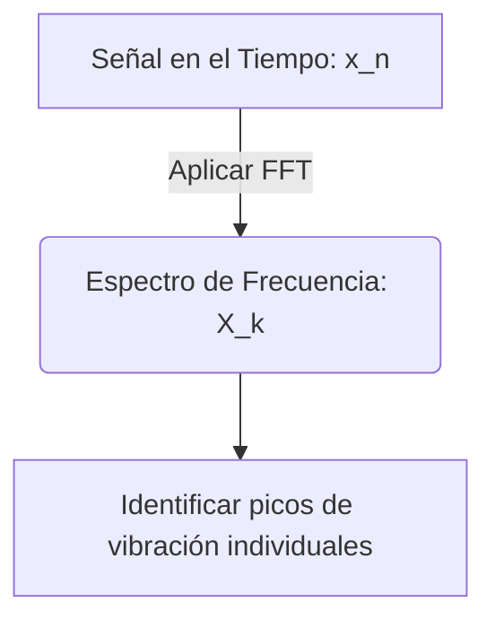
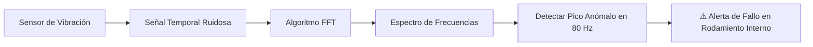

# 🚀 Guía Visual Práctica: La Transformada Rápida de Fourier (FFT)

Bienvenido a esta guía visual y simplificada sobre la **Transformada Rápida de Fourier (FFT)**, una de las herramientas matemáticas y computacionales más importantes de la historia moderna, crucial para el procesamiento de señales, la compresión de datos y el **Mantenimiento Predictivo con Inteligencia Artificial**.

---

## 🥤 La Analogía del Smoothie (¿Qué hace la FFT?)

Imagina que tienes un **smoothie** (licuado) de frutas. Una vez mezclado, es casi imposible saber a simple vista cuántas fresas, plátanos o naranjas contiene. 

La **Transformada de Fourier** es como una máquina mágica que toma ese smoothie y te devuelve la receta exacta:

```text
🥤 Smoothie Mezclado (Señal en el Tiempo) ──▶ [ Transformada de Fourier ] ──▶ 🍓 5 Fresas + 🍌 1 Plátano + 🍊 2 Naranjas (Frecuencias)
```

En el mundo de la ingeniería:
*   **El Smoothie** es la vibración ruidosa de un motor (muchas piezas moviéndose a la vez).
*   **Las Frutas** son los componentes mecánicos individuales (el rodamiento, el eje, el ventilador) vibrando cada uno a su propia velocidad (frecuencia).

---

## 📈 Del Tiempo a la Frecuencia

Una señal física (como el sonido o la vibración de un sensor) se registra en el **Dominio del Tiempo**. La FFT nos permite cruzar el portal hacia el **Dominio de la Frecuencia**.



### Visualización Conceptual

```text
Señal en el Tiempo (Vibración mezclada)
   1.5 ^         /\
   1.0 |        /  \   /\
   0.5 |  /\   /    \ /  \  /\
   0.0 | /  \ /      V    \/  \
  -0.5 +----------------------------> Tiempo (s)

                  ▼  [ APLICAR FFT ]

Espectro de Frecuencia (Fallas identificadas)
  Amplitud
   5.0 ^          | (Falla en Rodamiento)
   4.0 |          |
   3.0 |          |                   | (Vibración Normal del Eje)
   2.0 |          |                   |
   1.0 |    .     |    .              |
   0.0 +----+-----+----+--------------+------> Frecuencia (Hz)
           10Hz  50Hz 80Hz          120Hz
```

---

## 🧮 La Matemática Simplificada

### 1. La Transformada Discreta de Fourier (DFT)
Para convertir muestras digitales de tiempo $x_n$ en componentes de frecuencia $X_k$, usamos la fórmula:

$$X_k = \sum_{n=0}^{N-1} x_n \cdot e^{-i 2\pi \frac{k}{N} n}$$

*   $x_n$: La muestra de vibración en el instante $n$.
*   $X_k$: La fuerza (amplitud) de la frecuencia $k$.
*   $e^{-i 2\pi \frac{k}{N} n}$: La base matemática (senos y cosenos) que detecta si esa frecuencia específica está presente en la señal.

### 2. ¿Por qué la FFT es "Rápida"?
Calcular la fórmula anterior de forma directa toma mucho tiempo de procesamiento. El algoritmo **FFT (Cooley-Tukey)** divide recursivamente los datos en muestras pares e impares, reutilizando los cálculos matemáticos:

| Algoritmo | Complejidad de Operaciones | Tiempo para $N = 1,048,576$ muestras |
| :--- | :--- | :--- |
| **DFT Clásica** | $\mathcal{O}(N^2)$ | ~3 horas (Demasiado lento) |
| **FFT (Rápida)** | $\mathcal{O}(N \log_2 N)$ | **~0.1 segundos** (Tiempo Real) |

---

## 🏭 Aplicación en Mantenimiento Predictivo (IA)

En una fábrica inteligente, los sensores de vibración registran datos continuamente. Un rodamiento mecánico defectuoso genera pequeños impactos metálicos repetitivos a una frecuencia muy específica (conocida como frecuencia de falla, por ejemplo, **BPFI** - *Ball Pass Frequency Inner Race*).



### Transformación de Señales a Imágenes (Deep Learning)
Para utilizar la **Visión Computacional** en el mantenimiento predictivo, los ingenieros de IA convierten estas señales de frecuencia en imágenes 2D:

1.  **Espectrogramas (STFT):** Mapas de calor que muestran cómo cambian las frecuencias a lo largo del tiempo.
2.  **Campos Angulares de Gramian (GAF):** Codificación de la señal temporal en una matriz de ángulos 2D.

Estas imágenes son alimentadas a una **Red Neuronal Convolucional (CNN)** (como ResNet o YOLO) para clasificar automáticamente si la máquina está sana o experimenta algún tipo de falla.

---

## 💻 Ejemplo Rápido en Python

```python
import numpy as np
import scipy.fftpack
import matplotlib.pyplot as plt

# 1. Crear una señal limpia mezclando dos frecuencias (50Hz y 120Hz) con ruido
fs = 1000 # Frecuencia de muestreo (1000 Hz)
t = np.linspace(0, 1.0, fs, endpoint=False)
signal = np.sin(2 * np.pi * 50 * t) + 0.5 * np.sin(2 * np.pi * 120 * t)
noise = np.random.normal(0, 0.5, signal.shape)
noisy_signal = signal + noise

# 2. Aplicar la Transformada Rápida de Fourier (FFT)
fft_output = scipy.fft.fft(noisy_signal)
frequencies = scipy.fft.fftfreq(len(t), 1/fs)

# 3. Graficar los resultados espectrales
plt.plot(frequencies[:fs//2], np.abs(fft_output)[:fs//2])
plt.title("Espectro de Frecuencias (FFT)")
plt.xlabel("Frecuencia (Hz)")
plt.ylabel("Amplitud")
plt.grid()
plt.show()
```

---
*Desarrollado para el portafolio de proyectos de Inteligencia Artificial aplicada a la Industria 4.0.*
